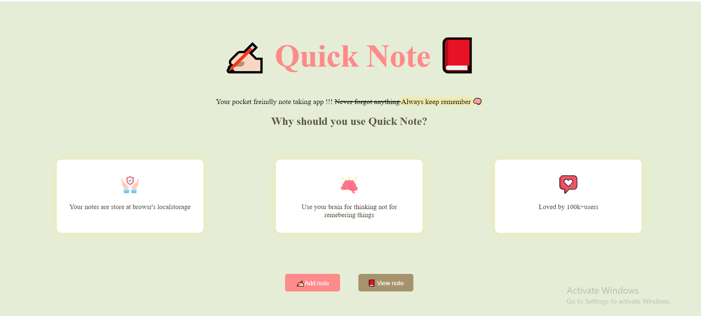
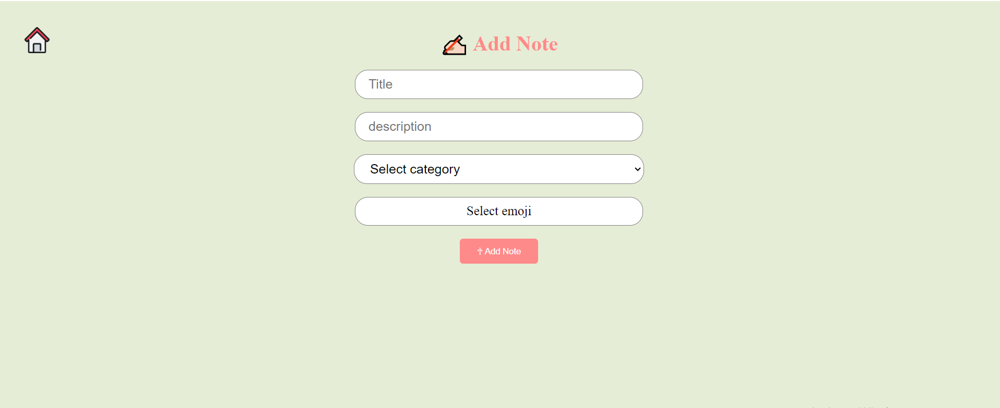
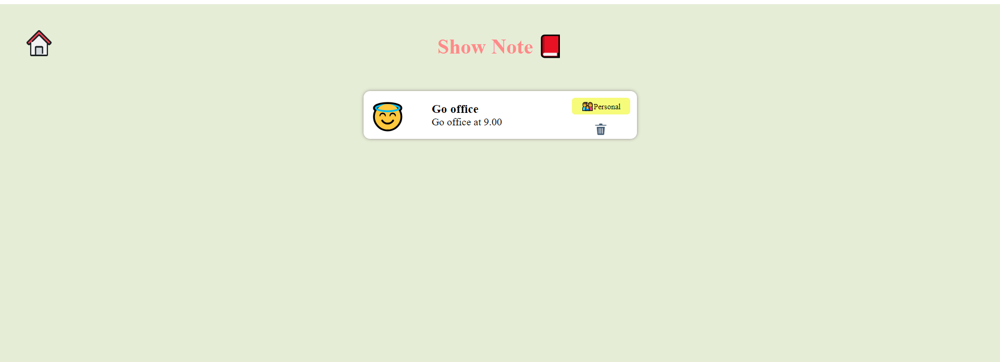
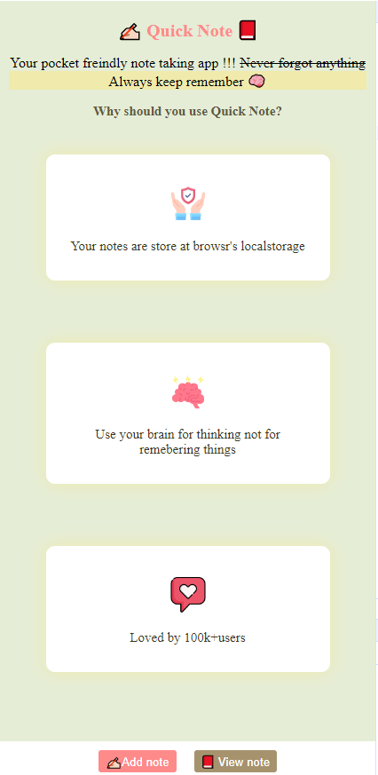

<h1>Quick Note Application</h1>

<h2>Features<h2>
<h3>Create Notes:</h3> Users can add new notes with a title and content.

<h3>Show note :</h3> User can access notes from local storage which  stored .

<h3>Delete Notes:</h3> Remove notes that are no longer needed.

<h3>Local Storage:</h3> 
Notes are saved in the browser's local storage, so data persists even after page refresh. 
**[{title: "Go office", description: "Go office at 9.00", category: "personal", emoji: "😇"}]
0**
: 
**{title: "Go office", description: "Go office at 9.00", category: "personal", emoji: "😇"}**
<h3>Responsive Design:</h3> Works seamlessly across different devices.

